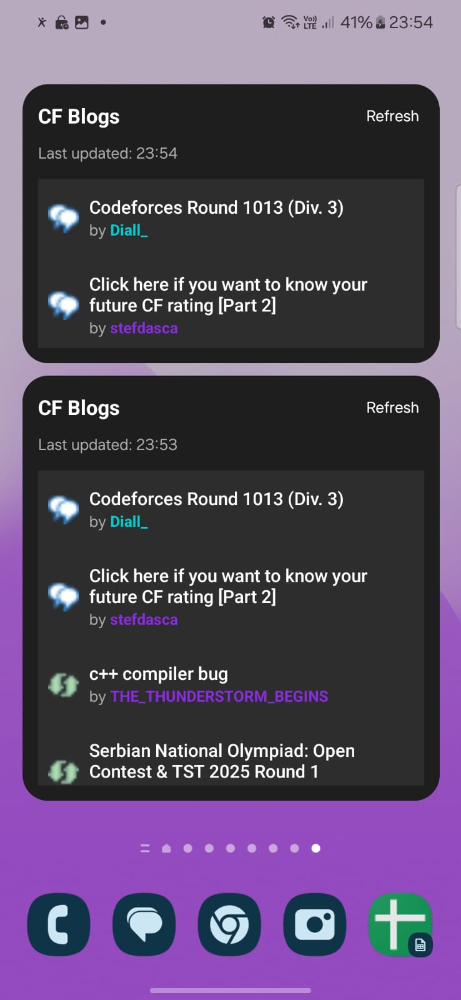

# Codeforces Recent Actions

A beautiful Material 3 Android app that shows recent  blog posts. Features a home screen widget for quick access to recent content.

## Features

- 📱 Real-time Updates: Get instant notifications for new Codeforces blogs
- 🔍 Smart Filtering: 
  - LLM-based filtered mode to show only quality content
  - Filter blogs by user rating (gray, green, cyan, blue, violet, yellow)
  - Toggle for unrated/announcement content
- 📊 Widget Support: Add a home screen widget to monitor blogs
- 🌙 Dark Mode: Full support for system dark mode
- 💾 Offline Support: View previously loaded blogs without internet
- 🎨 Material You: Follows system theme colors
- 🔄 Background Updates: Automatically refreshes content
- 📖 Open Source: Free and open source on GitHub

## Screenshots

### App Screenshots

<div align="center">
  <table>
    <tr>
      <td align="center">
        <h3>Light Mode</h3>
        
      </td>
      <td align="center">
        <h3>Dark Mode</h3>
        
      </td>
    </tr>
  </table>
</div>

### Widget Screenshots

<div align="center">
  <table>
    <tr>
      <td align="center">
        <h3>Light Mode</h3>
        
      </td>
      <td align="center">
        <h3>Dark Mode</h3>
        
      </td>
    </tr>
  </table>
</div>

## Installation

### F-Droid (coming soon)
Coming soon.

### Github Releases
You can install the latest dev build from github releases.

### Building from Source
1. Clone the repository
```bash
git clone https://github.com/yourusername/CF-Widget.git
```

2. Open the project in Android Studio

3. Build and run the app

## Features in Detail

### Main App
- View recent actions from Codeforces in a beautiful Material 3 interface
- Pull-to-refresh to update content
- Filtered mode to show only quality content
- Direct URL handling for Codeforces links
- Dark mode support
- Offline support for previously loaded content

### Home Screen Widget
- Quick access to recent actions
- Auto-refreshes every 30 minutes
- Manual refresh option
- Shows blog title, author, and type
- Click to open in browser
- Adapts to system theme

## Contributing

Contributions are welcome! Please feel free to submit a Pull Request.

## License

This project is licensed under the MIT License - see the [LICENSE](LICENSE) file for details.

## Acknowledgments

- [Material 3](https://m3.material.io/) for the beautiful design system
- [Jetpack Compose](https://developer.android.com/jetpack/compose) for the modern UI toolkit 